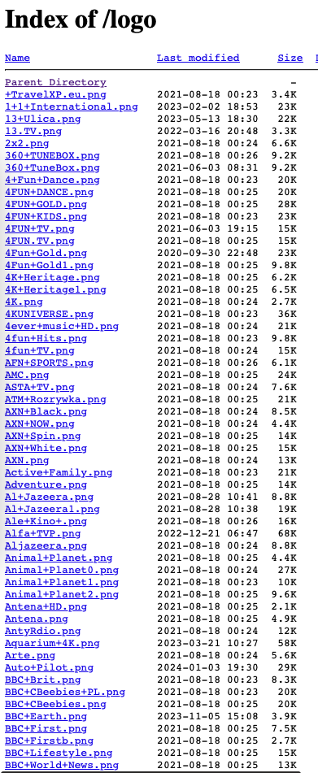

## M3U Logo Matcher

Simple script that will match logos with TV programmes provided by you.

### NOTE!
This may **NOT** be 100% accurate.

### Based on
- urllib
- pathlib
- difflib
- [ipytv](https://github.com/Beer4Ever83/ipytv)
- re
- os

### Usage
```bash
python3 <path-to-script> -u "<logos URL>" -m "<m3u URL/path>" (-r <ratio>)
```

### Supported logo providers
Any that display logos as a file tree. A good example is [this provider](http://epg.ovh/logo).

"as a file tree". What does it mean?



### Result
When everything is done, playlist file is **OVERWRITTEN**!

### Example usage
```bash
python3 <path-to-script> -u "http://epg.ovh/logo" -m "m3u_list.m3u" -r 0.7
```

### Available parameters
- -u/--url - logos source URL
- -m/--m3u - URL/absolute path to m3u
- -v/--verbose - enable verbose mode
- -r/--ratio - customize similarity ratio